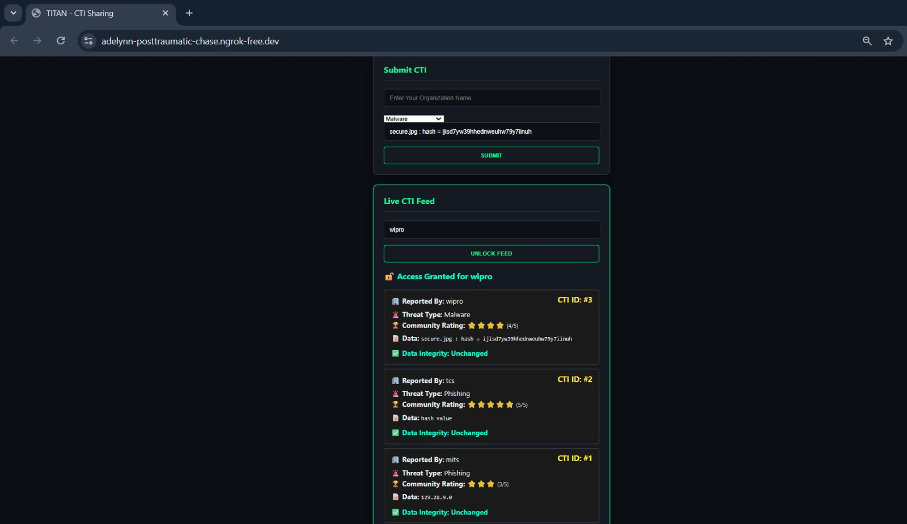
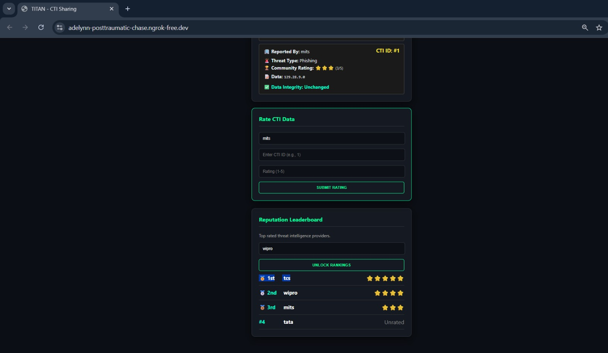
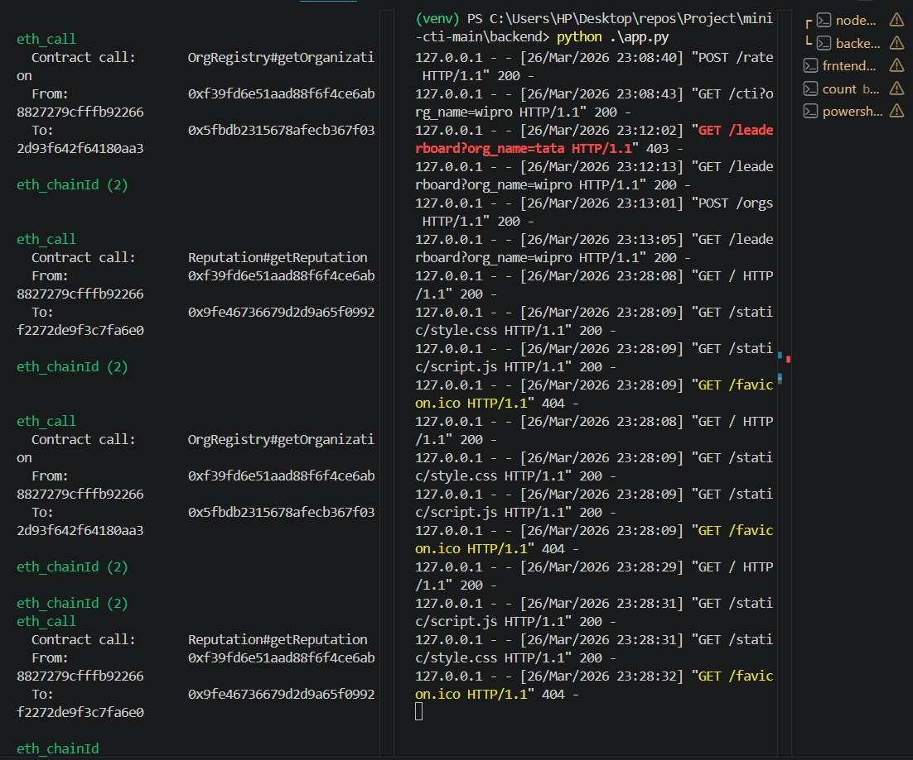
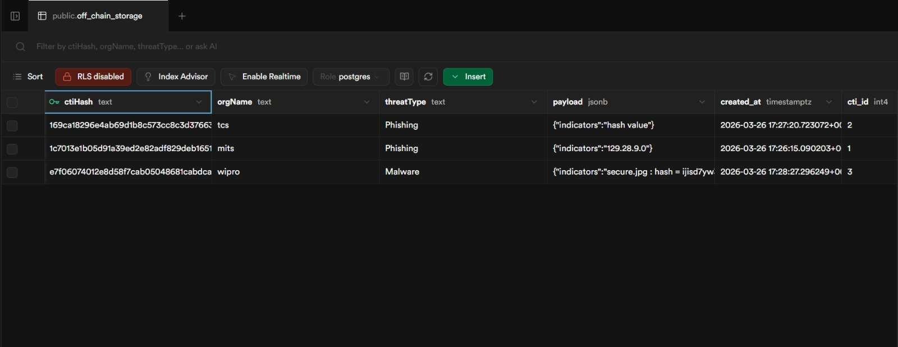
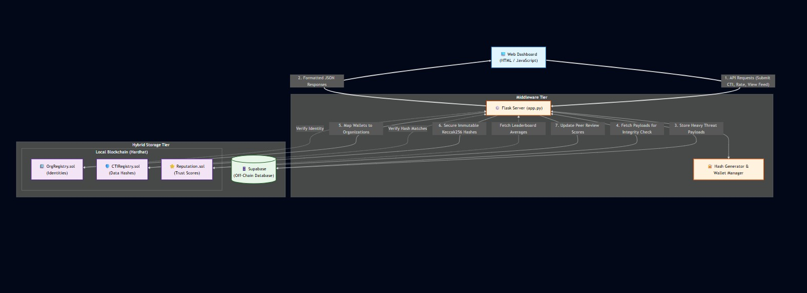

# TITAN: Trust-Aware Decentralized Cyber Threat Intelligence Sharing Platform

## Overview

TITAN is a decentralized Cyber Threat Intelligence (CTI) sharing platform that enables organizations to securely exchange threat intelligence without relying on a central authority.

The platform combines blockchain technology, smart contracts, reputation scoring, and hybrid storage architecture to ensure transparency, trust, and data integrity in threat intelligence sharing.

---

## Problem Statement

Traditional Cyber Threat Intelligence sharing systems are centralized and face several challenges:

* Single Point of Failure (SPOF)
* Lack of transparency and auditability
* Risk of fake or low-quality threat intelligence
* Freeriding by participants
* Limited trust among organizations

TITAN addresses these challenges through decentralized trust management and blockchain-based verification.

---

## Key Features

* Secure CTI submission and sharing
* Blockchain-based integrity verification
* Reputation-driven trust scoring
* Organization registration and management
* Off-chain storage for threat payloads
* Real-time CTI feed access
* Reputation leaderboard for trusted contributors
* Hybrid storage architecture using blockchain and database systems

---

## Technology Stack

### Frontend

* HTML
* CSS
* JavaScript

### Backend

* Python
* Flask

### Blockchain

* Solidity
* Ethereum
* Hardhat
* Web3.py

### Database

* Supabase

---

## System Architecture

The system consists of:

* Web Dashboard
* Flask Backend Server
* Ethereum Smart Contracts
* Hardhat Local Blockchain
* Supabase Off-Chain Storage

### Smart Contracts

* OrgRegistry.sol – Organization registration and identity management
* CTIRegistry.sol – CTI hash registration and verification
* Reputation.sol – Reputation score management

---

## Workflow

1. Organizations register on the platform.
2. Threat intelligence is submitted through the dashboard.
3. Threat data is validated.
4. A cryptographic hash of the CTI data is generated.
5. Full payload is stored off-chain in Supabase.
6. Hash is stored on the blockchain using smart contracts.
7. Participants rate CTI quality.
8. Reputation scores are updated automatically.
9. Verified CTI feeds are shared with participants.

---

## Screenshots

### Dashboard

### Reputation Leaderboard

### Blockchain and Backend Interaction

### Off-Chain Storage

### System Architecture

---

## My Contributions - Backend Development

I primarily contributed to the **backend development and system integration** of TITAN, focusing on connecting the frontend, blockchain smart contracts, and off-chain database.

### 🔹 Backend API Development

* Developed the backend using **Python and Flask**.
* Implemented REST API endpoints for organization registration, CTI submission, CTI retrieval, verification, and reputation-related operations.
* Handled HTTP requests, JSON data, validation, and API responses between the frontend and backend.

### 🔹 Blockchain Integration

* Integrated the Flask backend with the Ethereum-compatible blockchain using **Web3.py**.
* Connected the backend with TITAN's deployed smart contracts.
* Implemented interaction with the `OrgRegistry`, `CTIRegistry`, and `Reputation` smart contracts.
* Verified whether organizations are registered before allowing them to submit CTI.
* Registered CTI hashes on the blockchain and retrieved blockchain records for verification.

### 🔹 CTI Integrity Verification

* Implemented cryptographic hashing of CTI data before registering it on the blockchain.
* Used the blockchain-stored hash as an immutable reference for integrity verification.
* Compared the hash of the retrieved off-chain CTI data with the blockchain record to detect whether the data had been modified.

### 🔹 Hybrid Storage Integration

* Integrated the backend with **Supabase** for off-chain storage of CTI payloads and metadata.
* Designed the workflow where large CTI payloads are stored off-chain while their cryptographic hashes are recorded on-chain.
* Maintained the relationship between blockchain records and their corresponding off-chain CTI data.

### 🔹 System Integration

* Connected the major TITAN components through the backend:

  * **Frontend → Flask REST API**
  * **Flask → Supabase**
  * **Flask → Web3.py → Smart Contracts**
* Implemented the backend workflow for submitting, retrieving, and verifying CTI.
* Handled blockchain transaction responses and integrated them with the application's API responses.

### 🔹 Security & Validation

* Implemented organization validation before blockchain operations.
* Used cryptographic hashing to detect unauthorized modification of stored CTI data.
* Added validation and error handling for invalid requests, unregistered organizations, and blockchain/database failures.

### 🛠️ Technologies Used

**Python • Flask • REST APIs • Web3.py • Solidity Smart Contracts • Ethereum/Hardhat • Supabase • JSON • Cryptographic Hashing**

---

## Future Enhancements

* AI-assisted threat validation
* Public Ethereum deployment
* STIX/TAXII integration
* Real-time threat intelligence feeds
* Advanced trust and reputation algorithms

---

## Academic Project

Department of Cyber Security

Muthoot Institute of Technology and Science (MITS)

Academic Year: 2025–2026
